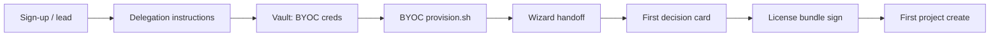

# Design partner onboarding — engineering runbook (SPINE-020)

> **Task:** SPINE-020 · **Gate:** [`docs/V1_SHIP_CHECKLIST.md`](V1_SHIP_CHECKLIST.md) §6 — *Customer onboarding flow end-to-end*  
> **Audience:** Vendor operator or AI agent driving a design partner from sign-up through first project.  
> **Companion docs:** [`docs/FOUNDER_WALKTHROUGH.md`](FOUNDER_WALKTHROUGH.md) (post-onboarding golden path), [`docs/VAULT_PATHS_CHECKLIST.md`](VAULT_PATHS_CHECKLIST.md) (production vault population)

---

## Honest holds (read first)

| Claim in marketing / checklist | Reality at v1.0 ship |
|--------------------------------|----------------------|
| `spine.dev/byoc` sign-up form collects email + cloud + bundle | **Human / marketing path.** There is no wired webhook from the landing form into `tools/byoc/provision.sh` yet. Treat the form as lead capture; the **automated path is the BYOC CLI** (or an AI agent invoking it per #21). |
| Provision runs automatically after sign-up | **Manual or agent-driven.** Operator (or agent) runs `tools/byoc/provision.sh` from vendor infra after delegation + vault creds are in place. |
| Admin email with Hub URL + first-login link | **Partially automated.** BYOC handoff JSON + wizard manifest are written; transactional email infra (`sales@`, `support@`) is a §3 launch gate — until then, send the Hub URL + Keycloak login by hand. |
| First Decision Card within 5 minutes | **Depends on Hub start + bootstrap.** Card title is *"Day-0 bootstrap complete"* (hub-global, not project-scoped). Laptop dev may show `intake_briefing` on first project instead; see step 6. |
| `spine project new "test" --type feature` | **API path is more reliable today.** CLI `orchestrator/bin/spine project new` exists but has known rough edges (doctor warnings, type validation). Prefer `POST /api/v2/projects` for smoke; CLI is acceptable when Hub + MCP transport are healthy. |

**Laptop shortcut:** Design partners evaluating on their own machine can skip BYOC and run [`tools/hub-up.sh`](../tools/hub-up.sh) + [`hub/wizard/init.sh`](../hub/wizard/init.sh) — same wizard handoff, no cloud delegation. Use [`tools/design-partner-smoke.sh`](../tools/design-partner-smoke.sh) to verify that path.

---

## Flow overview



| Step | Owner | Artifact |
|------|-------|----------|
| 1 Sign-up | Marketing + founder | Lead record (email, cloud, tier intent) |
| 2 Delegation | Customer cloud admin | Cross-account role / SA / team invite |
| 3 Vault creds | Vendor operator | `vault://kv/byoc/<account>/<cloud>_credentials` |
| 4 BYOC provision | Vendor automation | Cloud stack + handoff JSON on stdout |
| 5 Wizard handoff | Hub Day-0 | `hub/_state/wizard_manifest.json`, `hub_id.txt` |
| 6 First decision card | Hub runtime | Decision queue: bootstrap complete |
| 7 License bundle | Vendor signing | Signed bundle JSON → customer Hub import |
| 8 First project | Design partner | Project UUID + `intake_briefing` card |

---

## Prerequisites

- Vendor production vault unsealed; signing key rehearsal done per [`V1_SHIP_CHECKLIST.md`](V1_SHIP_CHECKLIST.md) §2a.
- BYOC cloud script for target cloud exists under `tools/byoc/clouds/<cloud>.sh`.
- Hub image version pinned (`--hub-version=1.0.0` or current tag).
- License bundle UUID pre-generated (`uuidgen`).
- Customer admin email confirmed (becomes Keycloak bootstrap user per [`hub/wizard/init.sh`](../hub/wizard/init.sh)).

---

## Step 1 — Sign-up (lead capture)

- [ ] **Collect** design partner email, company, target cloud (`aws` \| `azure` \| `gcp` \| `railway` \| `fly` \| `do`), and intended tier (`founder` \| `team` \| `enterprise`).
- [ ] **Record** account reference (AWS account ID, Azure subscription, GCP project ID, Railway team slug, etc.) — becomes `--account=` in provision.
- [ ] **Assign** internal `bundle_id` (UUID) for this customer; keep mapping in vendor ops tracker.

**Verification:** Lead row exists with email + cloud + account ref + `bundle_id`. No automation required for this step at v1.0.

---

## Step 2 — Delegation instructions

Send cloud-specific delegation steps. Customer must grant Spine a **delegated role** in **their** account (per #15 — vendor never holds customer workloads).

| Cloud | Customer action | Maps to `--credentials-ref` |
|-------|-----------------|----------------------------|
| **AWS** | Create IAM role `SpineByoc` with trust policy for vendor account; grant least-privilege policy for EC2/EKS + S3 state | `vault://kv/byoc/<account>/aws_assume_role` |
| **Azure** | Delegated access package (DAP) or service principal with Contributor on target RG | `vault://kv/byoc/<account>/azure_credentials` |
| **GCP** | Service account + `roles/owner` or scoped custom role on target project | `vault://kv/byoc/<account>/gcp_credentials` |
| **Railway** | Team invite for vendor automation user + project token | `vault://kv/byoc/<account>/railway_credentials` |
| **Fly.io** | Org token scoped to deploy | `vault://kv/byoc/<account>/fly_credentials` |
| **DigitalOcean** | API token with write scope | `vault://kv/byoc/<account>/do_credentials` |

- [ ] **Confirm** customer completed delegation (screenshot, CloudTrail event, or test `sts assume-role` / equivalent).
- [ ] **Document** expiry / rotation date for delegated credentials.

**Verification (AWS example, after creds in vault):**

```bash
# Dry-run plan only — no cloud mutations
tools/byoc/provision.sh --non-interactive --dry-run \
  --cloud=aws --account=arn:aws:iam::123456789012:role/SpineByoc \
  --region=us-east-1 --mode=ec2 \
  --hub-version=1.0.0 --bundle-id=<UUID> \
  --admin-email=partner@example.com \
  --credentials-ref=vault://kv/byoc/123456789012/aws_assume_role
```

Expect exit `0` and a JSON handoff plan on stdout (no secret values logged).

---

## Step 3 — Vault credential storage

Per [`V1_SHIP_CHECKLIST.md`](V1_SHIP_CHECKLIST.md) §6 and #9 (vault-only secrets):

- [ ] **Write** delegated credentials to vendor vault (never git, never env files):

```bash
# Example — use your vault CLI; path must match --credentials-ref
spine-vault kv put kv/byoc/<account>/aws_assume_role \
  role_arn=arn:aws:iam::123456789012:role/SpineByoc \
  external_id=<vendor-external-id>
```

- [ ] **Cross-check** extended production paths in [`docs/VAULT_PATHS_CHECKLIST.md`](VAULT_PATHS_CHECKLIST.md) for the Hub that will run in customer cloud (Postgres, Keycloak, LLM keys, federation if child Hub).
- [ ] **Confirm** `tools/audit-secrets.sh` still exits 0 in repo (no value leaks in code).

**Verification:**

```bash
bash tools/audit-secrets.sh
# Vault read succeeds (adapter-specific); value must NOT appear in shell history or logs
```

---

## Step 4 — BYOC provision

Orchestrator: [`tools/byoc/provision.sh`](../tools/byoc/provision.sh) dispatches to `tools/byoc/clouds/<cloud>.sh`. Runs from **vendor** infrastructure using **customer** delegated creds.

- [ ] **Run** non-interactive provision (remove `--dry-run` for live):

```bash
tools/byoc/provision.sh --non-interactive \
  --cloud=aws \
  --account=arn:aws:iam::123456789012:role/SpineByoc \
  --region=us-east-1 --mode=ec2 \
  --hub-version=1.0.0 \
  --bundle-id=<UUID> \
  --admin-email=partner@example.com \
  --credentials-ref=vault://kv/byoc/123456789012/aws_assume_role
```

- [ ] **Capture** handoff JSON from stdout (`hub_url`, `hub_id`, `admin_email`, state paths).
- [ ] **Teardown drill** (optional staging): `tools/byoc/provision.sh --destroy --cloud=aws --account=... --force`

**Verification:**

```bash
# Replace HUB_URL from provision handoff
curl -fsS "${HUB_URL}/healthz" | python3 -m json.tool
# Expect HTTP 200; prod body: ok=true, db=true, mcp=true
```

---

## Step 5 — Wizard handoff

Day-0 wizard: [`hub/wizard/init.sh`](../hub/wizard/init.sh). On BYOC, this runs at first Hub boot (entrypoint) or manually before compose up.

- [ ] **Confirm** outputs exist on the Hub host:
  - `hub/_state/wizard_manifest.json` — non-secret audit record of choices
  - `hub/_state/hub_id.txt` — federation hub UUID
  - `.env.local` (gitignored) — compose env with vault **refs**, not values
- [ ] **Run** vault Day-0 wizard if bundled OpenBao: `./vault/init-wizard.sh` — populate `SPINE_VAULT_ROLE_ID` / wrapped secret-id placeholders.
- [ ] **Email** (or hand-deliver) to design partner:
  - Hub URL (`--hub-base-url` / handoff JSON)
  - Keycloak admin username + password reset link (or one-time password from vault path `spine/data/keycloak/bootstrap-admin`)

Non-interactive laptop reference (AI-driven per #21):

```bash
./hub/wizard/init.sh --non-interactive \
  --deployment-shape=byoc \
  --vault-adapter=aws \
  --keycloak=bundled \
  --llm-provider=anthropic \
  --admin-email=partner@example.com \
  --admin-password-from-vault-path=spine/data/keycloak/bootstrap-admin \
  --hub-base-url="${HUB_URL}"
```

**Verification:**

```bash
test -f hub/_state/wizard_manifest.json && test -f hub/_state/hub_id.txt
python3 -c "import json; print(json.load(open('hub/_state/wizard_manifest.json'))['hub_id'])"
```

---

## Step 6 — First decision card

- [ ] **Wait** ≤5 minutes after Hub containers healthy.
- [ ] **Open** Hub SPA → Decision Queue (`/spa/panels/decision-queue`) or poll API.

**Verification:**

```bash
curl -fsS "${HUB_URL}/api/v2/decisions?status=pending" | python3 -m json.tool
```

- [ ] **Expect** hub-global card with title **"Day-0 bootstrap complete"** (or equivalent bootstrap briefing kind in metadata).
- [ ] **Ack** the card in SPA (design partner UX) or:

```bash
DECISION_ID=<from-json>
curl -fsS -X POST "${HUB_URL}/api/v2/decisions/${DECISION_ID}/ack" \
  -H 'Content-Type: application/json' -d '{}'
```

**Laptop note:** After first project create, you will also see `intake_briefing` — that is the *project* onboarding card, not the Hub bootstrap card. Both are valid signals that the decision queue is live.

---

## Step 7 — License bundle issuance

Vendor-side only: [`tools/license-sign.sh`](../tools/license-sign.sh).

- [ ] **Prepare** payload JSON matching `license-bundle-v1` schema (tier, `bundle_id`, feature flags, hub_id, expiry).
- [ ] **Sign** with vendor vault key (Shamir-recovered signing key at `license/vendor_signing_key`):

```bash
tools/license-sign.sh sign \
  --payload payloads/design-partner-<slug>.json \
  --output signed/design-partner-<slug>.signed.json
```

- [ ] **Deliver** `signed.json` to customer Hub operator for import (psql / Hub license panel).
- [ ] **Federation cascade** (if child Hub): parent Hub registers child; verify `TRUSTED_VENDOR_FINGERPRINT` matches.

**Verification:**

```bash
tools/license-sign.sh verify --signed signed/design-partner-<slug>.signed.json
# On customer Hub: license panel shows tier + flags enabled
```

---

## Step 8 — Customer's first project

Design partner creates a project — this proves orchestrator + intake wiring.

### API path (recommended for smoke)

```bash
curl -fsS -X POST "${HUB_URL}/api/v2/projects" \
  -H 'Content-Type: application/json' \
  -d '{
    "name": "Design Partner Smoke",
    "project_type": "feature",
    "greenfield": true,
    "description": "First project — onboarding verification"
  }' | python3 -m json.tool
```

- [ ] **Expect** `project_uuid` in response.
- [ ] **Expect** pending `intake_briefing` decision for that project.

```bash
PROJECT_UUID=<from-create>
curl -fsS "${HUB_URL}/api/v2/projects/${PROJECT_UUID}" | python3 -m json.tool
curl -fsS "${HUB_URL}/api/v2/decisions?status=pending" | python3 -m json.tool
```

### CLI path (when MCP + Hub transport healthy)

```bash
orchestrator/bin/spine project new "Design Partner Smoke" --type feature --format json
```

- [ ] **Intake runs** after partner acks `intake_briefing` (see [`docs/FOUNDER_WALKTHROUGH.md`](FOUNDER_WALKTHROUGH.md) §B).

**Verification:** Project phase advances past `intake` after partner completes intake chat; at minimum, `intake_briefing` was acked and Product role enqueued.

---

## Local laptop smoke (design partner dev kit)

For partners testing before BYOC:

```bash
export ANTHROPIC_API_KEY='sk-ant-…'   # real key
bash tools/hub-up.sh --rebuild
./hub/wizard/init.sh    # interactive, or use non-interactive flags above
bash tools/design-partner-smoke.sh
```

The smoke script checks Hub health, decision queue reachability, and project create — or documents **SKIP** when Hub is not running.

---

## §6 gate checklist (copy for launch tracker)

| §6 item | Done | Evidence |
|---------|------|----------|
| Sign-up form / lead path | ☐ | Lead ID + email |
| Delegation instructions per cloud | ☐ | Customer confirmation |
| Credential storage `kv/byoc/...` | ☐ | Vault path + audit log |
| Provision script succeeds | ☐ | Handoff JSON + `curl healthz` |
| Wizard manifest + hub_id | ☐ | `hub/_state/*` paths |
| First Decision Card ≤5 min | ☐ | `GET /api/v2/decisions` screenshot |
| License bundle signed + imported | ☐ | `license-sign.sh verify` |
| First project + intake | ☐ | `project_uuid` + phase ≠ failed |

When all rows are checked for **at least one** design partner per segment (#14), §6 is ready for founder sign-off alongside §7.

---

## Related commands quick reference

| Action | Command |
|--------|---------|
| Hub up (laptop) | `bash tools/hub-up.sh` |
| Hub status | `bash tools/hub-up.sh --status` |
| Repo smoke gate | `bash tools/smoke-test.sh` |
| Onboarding smoke | `bash tools/design-partner-smoke.sh` |
| BYOC provision | `tools/byoc/provision.sh ...` |
| Day-0 wizard | `./hub/wizard/init.sh` |
| Golden path (post-onboarding) | `bash tools/golden-path-walkthrough.sh "My app"` |
| Vault paths audit | `bash tools/audit-secrets.sh` |

---

**Document control**

- Created: 2026-06-19 (SPINE-020)
- Author: AI orchestration, operator review pending
- Status: **CANONICAL** engineering runbook for V1 §6 design partner onboarding
- Next update: first real BYOC design partner dry-run (capture actual handoff JSON + card titles)
