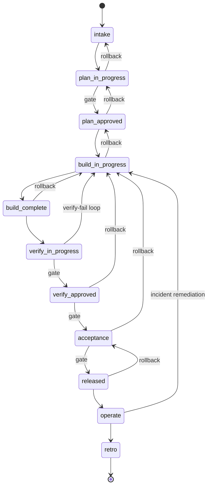

# Spine lifecycle — at a glance

> Newcomer's map of how a project moves through Spine v2. Three views:
> (1) ASCII flow, (2) phase progression, (3) approval flow.
> Canonical phase source: [`orchestrator/state/phases.yaml`](../../orchestrator/state/phases.yaml).
> Architecture context: [`docs/ARCHITECTURE.md`](../ARCHITECTURE.md) §2.

---

## 1. ASCII flow (top-down)

```
                            User
                             |
                             v
                     spine project new
                             |
                             v
                  +-----------------------+
                  |     ORCHESTRATOR      |   <-- thin coordinator
                  | (lifecycle state mch) |       (bash + Postgres)
                  +----------+------------+
                             |
              routes via shared/mcp/ to subsystems
                             |
       +---------------------+----------------------+
       |                     |                      |
       v                     v                      v
  +---------+          +----------+           +----------+
  |  PLAN   |  ---->   |  BUILD   |   ---->   |  VERIFY  |
  +---------+          +----------+           +----------+
   intake               engineer               scanners
   product/PRD          operator               ISO agents
   architect/TRD        datawright             sandbox
   planner/Roadmap      KG-aware roles         cross-LLM
       |                     |                      |
       +---------------------+----------------------+
                             |
              VerifyFindings -> Orchestrator
                             |
                  pass? --no--> reroute to BUILD
                             |
                            yes
                             v
                      user acceptance
                             |
                             v
                       release / operate
                             |
                             v
                +---------------------------+
                | spine_audit (append-only) |
                +---------------------------+
```

**Read this as:** the Orchestrator is a router and bookkeeper, not a smart agent. Every transition between phases is logged to `spine_audit`. Verify failures loop back to Build (bounded by `verify_build_loop_max = 5`). Once Verify is green, the user signs Acceptance and the project enters Release / Operate.

---

## 2. Phase progression (Mermaid state diagram)

The 11 canonical phases from `phases.yaml`. Forward arrows are the happy path; dashed arrows are rollbacks. Phases marked `(gate)` require a user-approval token before advancing.



**Read this as:** the state machine engine (`STORY-9.2.1`) treats `phases.yaml` as data — a transition `X -> Y` is valid only if `Y` appears in `phases[X].next` (forward) or `phases[X].rollback_to` (reverse). Adding a phase is a zero-migration change because `phase` is free text in `spine_lifecycle.project`. Org bundles (`EPIC-1.7`) can ship their own `sdlc-pipeline.yaml` to override the shape; a project locks its resolved pipeline version at creation time in `spine_lifecycle.project.pipeline_version`.

---

## 3. Approval flow (HMAC token + `transition.sh`)

User approvals are required at five gates: **plan_approved**, **verify_approved**, **acceptance**, **released**, and (per `phases.yaml`) any custom gate an org bundle adds. The token is HMAC-signed (`STORY-9.3.2`) and verified by the transition engine before any phase advance.

```mermaid
sequenceDiagram
    autonumber
    participant U as User
    participant UI as shared/ui (dashboard)
    participant ORCH as Orchestrator
    participant DB as spine_lifecycle (Postgres)
    participant AUD as spine_audit

    Note over U,UI: Phase X completes; artifact ready for sign-off
    UI->>U: Show artifact (PRD / TRD / Roadmap / VerifyFindings / Acceptance)
    U->>UI: Click "Approve"
    UI->>ORCH: approval_grant(project_id, phase=X, actor=U)
    ORCH->>ORCH: HMAC-sign token (expiry=168h default)
    ORCH->>DB: INSERT INTO approval (project_id, phase, token, expires_at)
    ORCH->>AUD: log("approval_granted", actor=U, phase=X)
    UI->>ORCH: phase_advance(project_id, target=Y)
    ORCH->>ORCH: transition.sh — verify token, check phases.yaml allows X->Y
    alt token valid AND transition legal
        ORCH->>DB: UPDATE project SET phase=Y; INSERT transition row
        ORCH->>AUD: log("phase_advanced", from=X, to=Y)
        ORCH-->>UI: 200 OK (new phase Y)
    else token invalid or expired
        ORCH->>AUD: log("approval_rejected", reason=...)
        ORCH-->>UI: 403 (re-approval required)
    end
```

**Read this as:** approval is a two-step sequence (grant token, then advance phase) so the same token can be revoked or audited independently of the transition. `transition.sh` is the single chokepoint — every phase change goes through it, and it always logs to `spine_audit` whether successful or not. Multi-approver gates (`STORY-9.3.3`) are supported by allowing multiple `approval` rows per (project, phase) and configuring the gate's quorum in `phases.yaml` under `transitions_metadata.gate_policy`.

---

## See also

- `orchestrator/state/phases.yaml` — the canonical phase set this document visualises
- `docs/ARCHITECTURE.md` §2 (architecture diagram) and §6 (migration phases)
- `docs/BACKLOG.md` — `STORY-9.1.1` (lifecycle schema), `STORY-9.2.1` (transition engine), `STORY-9.3.1/9.3.2/9.3.3` (gates + HMAC + multi-approver), `STORY-9.4.1` (routing), `STORY-9.8.1` (verify-fail loop)
- `shared/mcp/` (planned) — the MCP surface every subsystem talks through
- `Makefile.v2` — the umbrella that lets `make all-up` bring this whole picture online
